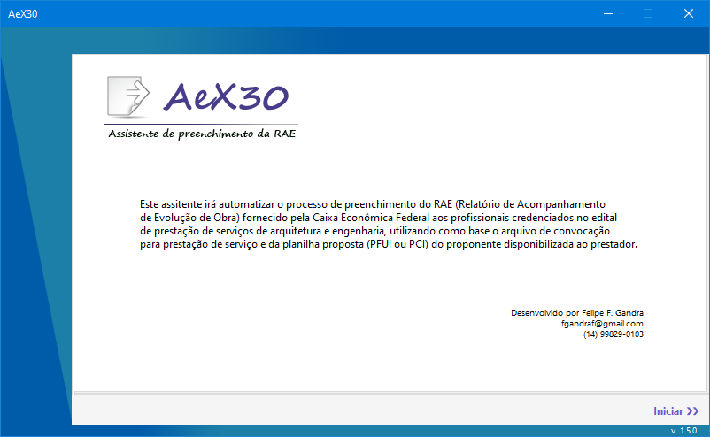
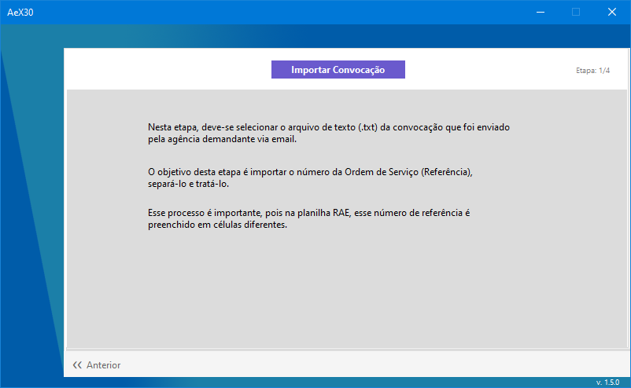
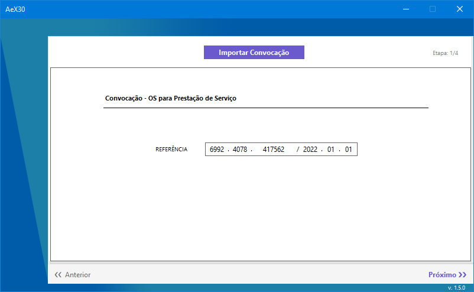
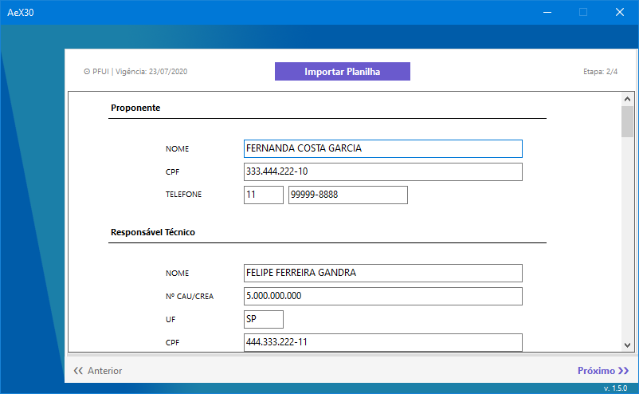
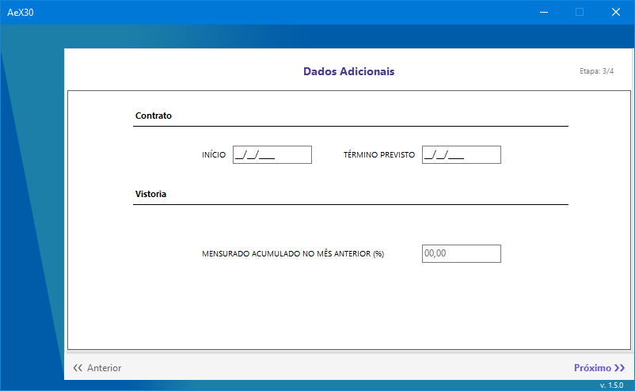
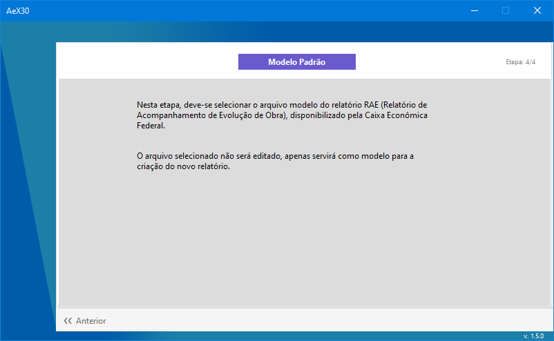

Software assistente desenvolvido para automatizar o processo de preenchimento dos relatórios RAE (Relatório de Acompanhamento de Evolução de Obra) fornecidos pela Caixa Econômica Federal aos Arquitetos e Engenheiros Credenciados.

---

## Tecnologias

* .NET Core 3.1;
* Windows Forms;
* C#;
* System.IO;
* NPOI Library.

## Versão

* 1.5.0

## Como usar

Por tratar-se de um assistente, o software é bastante intuitivo e autoexplicativo.

- #### Tela Inicial:
  
  

- #### Primeira etapa:
  
  

- #### Selecionar o arquivo de convocação:
  
  

- #### Verificar a importação dos dados e continuar:
  
  

- #### Segunda etapa:
  
  

- #### Selecionar o arquivo de proposta PFUI ou PCI:
  
  

- #### Verificar a importação dos dados e continuar:
  
  

- #### Terceira etapa:
  
  

- #### Quarta etapa:
  
  

- #### Selecionar o arquivo modelo do RAE:
  
  

- #### Clicar em Salvar como:
  
  

- #### Escolher o local a ser salvo o Relatório:
  
  

- #### Tela final:
  
  

## Observações

Para verificação do funcionamento do software, é possível utilizar os arquivos de modelo na pasta _Template. Dados sensíveis foram ocultados.

## Autor

Felipe Ferreira Gandra

fgandraf@gmail.com
